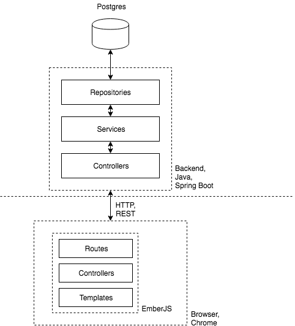

# abh-restaurants

## Introduction

This is ABH DevDays demo app.

## Architecture

The following is a diagram of the app architecture:



## Setup instructions

Install the following:

1. Install nodejs (10.16.3), https://nodejs.org/en/download/

3. Install Java JDK 1.8

4. Install maven https://maven.apache.org/download.cgi

5. Install Postgres 11.5 (https://www.postgresql.org/download/)

6. Install Postgis https://postgis.net/install/

7. Create a `abh-restaurants` database in postgres

8. Execute following on `abh-restaurants` database in postgres:

```sql
CREATE EXTENSION IF NOT EXISTS postgis;
CREATE EXTENSION IF NOT EXISTS "uuid-ossp";
```

9. (Optional) Docker (https://docs.docker.com/)

10. Git (https://git-scm.com/downloads)

11. Install `ember-cli` by running:

```bash
npm install -g ember-cli
```

12. Clone this repository by running:

```bash
git clone git@github.com:ATLANTBH/abh-restaurants.git
```
...or downloading project ZIP. For more on cloning see https://help.github.com/en/articles/cloning-a-repository.


## Verifying installation

The following should be executed to verify correct setup:

```bash
> java -version

java version "1.8.0_221"
Java(TM) SE Runtime Environment (build 1.8.0_221-b11)
Java HotSpot(TM) 64-Bit Server VM (build 25.221-b11, mixed mode)
```

```bash
> node -v

v10.16.3
```

```bash
> npm -v

6.9.0
```

```bash
> mvn --version

Apache Maven 3.6.2 (40f52333136460af0dc0d7232c0dc0bcf0d9e117; 2019-08-27T08:06:16-07:00)
Maven home: C:\opts\apache-maven-3.6.2\bin\..
Java version: 1.8.0_221, vendor: Oracle Corporation, runtime: C:\Program Files\Java\jdk1.8.0_221\jre
Default locale: en_US, platform encoding: Cp1252
```

```bash
> ember -v

ember-cli: 3.13.1
node: 10.16.3
os: win32 x64
OS name: "windows 7", version: "6.1", arch: "amd64", family: "windows"
```

```bash
> postgres --version

postgres (PostgreSQL) 11.5
```

```bash
> git --version

git version x.xx.x
```

## Running the application

### Start postgres database

If you have docker installed: start postgres database via docker/docker-compose:

```bash
cd webapp/deployment/local
docker-compose up
```

If you do not have docker installed: make sure you have postgres already started. To check if you have postgres setup correctly run the following:

```bash
psql -U postgres -d abh-restaurants -h localhost
```

### Start web application

For development, you can use IntelliJ (https://www.jetbrains.com/idea/download/) for backend and VSCode (https://code.visualstudio.com/download) for frontend.

Import the `webapp` project from `webapp/` directory in IntelliJ and start the web application by running `main` method in the `Application` class. If you want to run web application without importing into IntelliJ, run following:

```bash
mvn clean spring-boot:run -f webapp/pom.xml
```

### Start emberjs frontend

Install dependency packages by running:

```bash
cd frontend/
npm install
```
in `frontend/` directory.

Start the emberjs frontend by running:

```bash
ember s --proxy http://localhost:8080
```

Open http://localhost:4200 in browser. You can login as admin by using following credentials: `admin@example.com:admin`.

## Deployment of all services using Docker compose
The most simplest way to deploy all services as containers is by using Docker compose solution. To use Docker Compose, you need to install following tools:
- Docker 
- Docker Compose

On the root level of the project, you can find `docker-compose.yml` file which will be used for that purpose.
To deploy all services, simply use command:
```
docker-compose up -d
```

To check that all services are running, use following command and you should get similar output:
```
docker ps -a
...
$ docker ps -a
CONTAINER ID   IMAGE                      COMMAND                  CREATED       STATUS       PORTS                                                           NAMES
155bd1fa91d1   abh-restaurants_frontend   "ember s --proxy htt…"   3 hours ago   Up 3 hours   7020/tcp, 0.0.0.0:4200->4200/tcp, :::4200->4200/tcp, 7357/tcp   abh-restaurants_frontend_1
189ea445a8d7   abh-restaurants_postgres   "docker-entrypoint.s…"   3 hours ago   Up 3 hours   0.0.0.0:5432->5432/tcp, :::5432->5432/tcp                       abh-restaurants_postgres_1
90da2a2f9232   abh-restaurants_webapp     "mvn spring-boot:run…"   3 hours ago   Up 3 hours   0.0.0.0:8080->8080/tcp, :::8080->8080/tcp                       abh-restaurants_webapp_1
```

To check that application is running correctly, open http://localhost:4200 in browser. You can login as admin by using following credentials: `admin@example.com:admin` or create your own account.